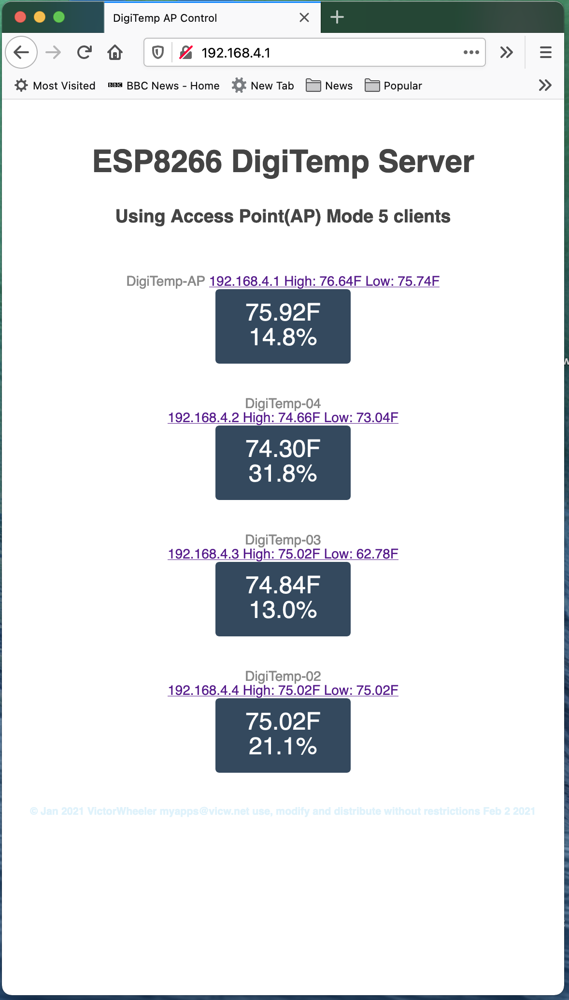

# DigiTempESP
Monitor several ESP8266+DHT22 sensors from a single web page.
This project is 2 parts a Host and Client the Host creates an access point and collects Temperature And Humidity from up to 7 clients displays the information in a single web page. The clients have a DHT22 or similar sensor attached and send cata to the host the host can have a sensor attached also.

 Root Page 

